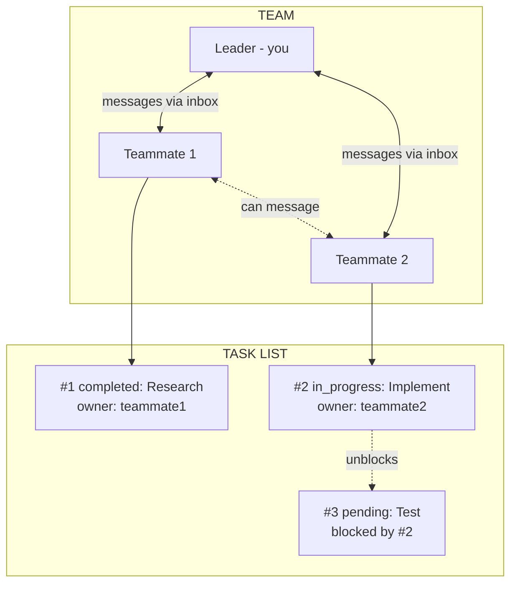
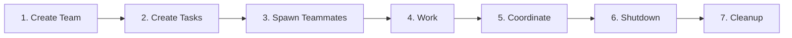
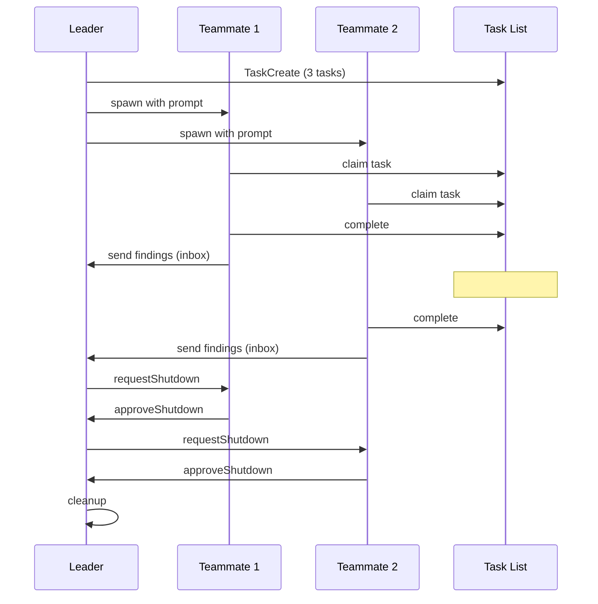
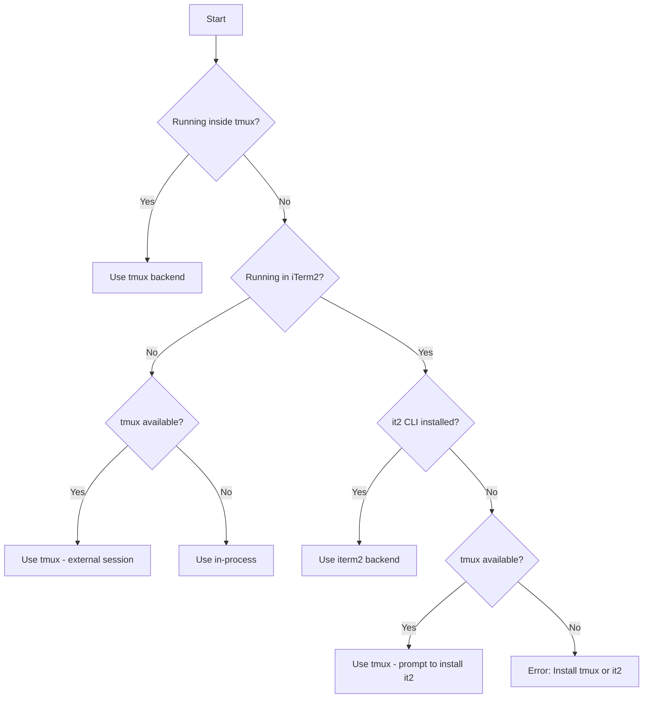

# Claude Code Swarm Orchestration

Master multi-agent orchestration using Claude Code's TeammateTool and Task system.

---

## Primitives

| Primitive | What It Is | File Location |
|-----------|-----------|---------------|
| **Agent** | A Claude instance that can use tools. You are an agent. Subagents are agents you spawn. | N/A (process) |
| **Team** | A named group of agents working together. One leader, multiple teammates. | `~/.claude/teams/{name}/config.json` |
| **Teammate** | An agent that joined a team. Has a name, color, inbox. Spawned via Task with `team_name` + `name`. | Listed in team config |
| **Leader** | The agent that created the team. Receives teammate messages, approves plans/shutdowns. | First member in config |
| **Task** | A work item with subject, description, status, owner, and dependencies. | `~/.claude/tasks/{team}/N.json` |
| **Inbox** | JSON file where an agent receives messages from teammates. | `~/.claude/teams/{name}/inboxes/{agent}.json` |
| **Message** | A JSON object sent between agents. Can be text or structured (shutdown_request, idle_notification, etc). | Stored in inbox files |
| **Backend** | How teammates run. Auto-detected: `in-process` (same process, invisible), `tmux` (separate panes, visible), `iterm2` (split panes in iTerm2). See [Spawn Backends](#spawn-backends). | Auto-detected based on environment |

### How They Connect



### Lifecycle



### Message Flow



---

## Table of Contents

1. [Core Architecture](#core-architecture)
2. [Two Ways to Spawn Agents](#two-ways-to-spawn-agents)
3. [Built-in Agent Types](#built-in-agent-types)
4. [Plugin Agent Types](#plugin-agent-types)
5. [TeammateTool Operations](#teammatetool-operations)
6. [Task System Integration](#task-system-integration)
7. [Message Formats](#message-formats)
8. [Orchestration Patterns](#orchestration-patterns)
9. [Environment Variables](#environment-variables)
10. [Spawn Backends](#spawn-backends)
11. [Error Handling](#error-handling)
12. [Complete Workflows](#complete-workflows)

---

## Core Architecture

### How Swarms Work

A swarm consists of:
- **Leader** (you) - Creates team, spawns workers, coordinates work
- **Teammates** (spawned agents) - Execute tasks, report back
- **Task List** - Shared work queue with dependencies
- **Inboxes** - JSON files for inter-agent messaging

### File Structure

```
~/.claude/teams/{team-name}/
├── config.json              # Team metadata and member list
└── inboxes/
    ├── team-lead.json       # Leader's inbox
    ├── worker-1.json        # Worker 1's inbox
    └── worker-2.json        # Worker 2's inbox

~/.claude/tasks/{team-name}/
├── 1.json                   # Task #1
├── 2.json                   # Task #2
└── 3.json                   # Task #3
```

### Team Config Structure

```json
{
  "name": "my-project",
  "description": "Working on feature X",
  "leadAgentId": "team-lead@my-project",
  "createdAt": 1706000000000,
  "members": [
    {
      "agentId": "team-lead@my-project",
      "name": "team-lead",
      "agentType": "team-lead",
      "color": "#4A90D9",
      "joinedAt": 1706000000000,
      "backendType": "in-process"
    },
    {
      "agentId": "worker-1@my-project",
      "name": "worker-1",
      "agentType": "Explore",
      "model": "haiku",
      "prompt": "Analyze the codebase structure...",
      "color": "#D94A4A",
      "planModeRequired": false,
      "joinedAt": 1706000001000,
      "tmuxPaneId": "in-process",
      "cwd": "/Users/me/project",
      "backendType": "in-process"
    }
  ]
}
```

---

## Two Ways to Spawn Agents

### Method 1: Task Tool (Subagents)

Use Task for **short-lived, focused work** that returns a result:

```javascript
Task({
  subagent_type: "Explore",
  description: "Find estimator files",
  prompt: "Find all estimation-related files in this codebase",
  model: "haiku"  // Optional: haiku, sonnet, opus
})
```

**Characteristics:**
- Runs synchronously (blocks until complete) or async with `run_in_background: true`
- Returns result directly to you
- No team membership required
- Best for: searches, analysis, focused research

### Method 2: Task Tool + team_name + name (Teammates)

Use Task with `team_name` and `name` to **spawn persistent teammates**:

```javascript
// First create a team
Teammate({ operation: "spawnTeam", team_name: "my-project" })

// Then spawn a teammate into that team
Task({
  team_name: "my-project",        // Required: which team to join
  name: "econometrics-reviewer",   // Required: teammate's name
  subagent_type: "compound-science:review:econometrician",
  prompt: "Review all estimation code for methodological issues. Send findings to team-lead via Teammate write.",
  run_in_background: true         // Teammates usually run in background
})
```

**Characteristics:**
- Joins team, appears in `config.json`
- Communicates via inbox messages
- Can claim tasks from shared task list
- Persists until shutdown
- Best for: parallel work, ongoing collaboration, pipeline stages

### Key Difference

| Aspect | Task (subagent) | Task + team_name + name (teammate) |
|--------|-----------------|-----------------------------------|
| Lifespan | Until task complete | Until shutdown requested |
| Communication | Return value | Inbox messages |
| Task access | None | Shared task list |
| Team membership | No | Yes |
| Coordination | One-off | Ongoing |

---

## Built-in Agent Types

These are always available without plugins:

### Bash
```javascript
Task({
  subagent_type: "Bash",
  description: "Run git commands",
  prompt: "Check git status and show recent commits"
})
```
- **Tools:** Bash only
- **Model:** Inherits from parent
- **Best for:** Git operations, command execution, system tasks

### Explore
```javascript
Task({
  subagent_type: "Explore",
  description: "Find API endpoints",
  prompt: "Find all API endpoints in this codebase. Be very thorough.",
  model: "haiku"  // Fast and cheap
})
```
- **Tools:** All read-only tools (no Edit, Write, NotebookEdit, Task)
- **Model:** Haiku (optimized for speed)
- **Best for:** Codebase exploration, file searches, code understanding
- **Thoroughness levels:** "quick", "medium", "very thorough"

### Plan
```javascript
Task({
  subagent_type: "Plan",
  description: "Design estimation strategy",
  prompt: "Create an implementation plan for the difference-in-differences estimation with staggered treatment"
})
```
- **Tools:** All read-only tools
- **Model:** Inherits from parent
- **Best for:** Architecture planning, implementation strategies

### general-purpose
```javascript
Task({
  subagent_type: "general-purpose",
  description: "Research and implement",
  prompt: "Research IV estimation best practices and implement the 2SLS estimator for the returns-to-education model"
})
```
- **Tools:** All tools (*)
- **Model:** Inherits from parent
- **Best for:** Multi-step tasks, research + action combinations

### claude-code-guide
```javascript
Task({
  subagent_type: "claude-code-guide",
  description: "Help with Claude Code",
  prompt: "How do I configure MCP servers?"
})
```
- **Tools:** Read-only + WebFetch + WebSearch
- **Best for:** Questions about Claude Code, Agent SDK, Anthropic API

### statusline-setup
```javascript
Task({
  subagent_type: "statusline-setup",
  description: "Configure status line",
  prompt: "Set up a status line showing git branch and node version"
})
```
- **Tools:** Read, Edit only
- **Model:** Sonnet
- **Best for:** Configuring Claude Code status line

---

## Plugin Agent Types

From the `compound-science` plugin (examples):

### Review Agents
```javascript
// Econometrics review
Task({
  subagent_type: "compound-science:review:econometrician",
  description: "Econometrics review",
  prompt: "Review this estimation code for methodological correctness and standard error handling"
})

// Numerical audit
Task({
  subagent_type: "compound-science:review:numerical-auditor",
  description: "Numerical audit",
  prompt: "Audit this simulation for numerical stability and convergence issues"
})

// Identification review
Task({
  subagent_type: "compound-science:review:identification-critic",
  description: "Identification check",
  prompt: "Review this identification strategy for threats to internal validity"
})

// Mathematical proof review
Task({
  subagent_type: "compound-science:review:mathematical-prover",
  description: "Proof review",
  prompt: "Review the identification proof for the structural model"
})

// Referee review
Task({
  subagent_type: "compound-science:review:referee",
  description: "Referee report",
  prompt: "Provide a referee-style assessment of this empirical analysis"
})
```

**All review agents from compound-science:**
- `econometrician` - Estimation methodology and standard errors
- `mathematical-prover` - Identification proofs and mathematical derivations
- `numerical-auditor` - Numerical stability, convergence, and computational accuracy
- `identification-critic` - Identification strategy and threats to validity
- `referee` - Journal referee-style assessment

### Research Agents
```javascript
// Literature research
Task({
  subagent_type: "compound-science:research:literature-scout",
  description: "Research IV methods",
  prompt: "Research current best practices for instrumental variable estimation with weak instruments"
})

// Methods research
Task({
  subagent_type: "compound-science:research:methods-researcher",
  description: "Research DiD methods",
  prompt: "Gather documentation on staggered difference-in-differences estimators and their assumptions"
})

// Data archaeology
Task({
  subagent_type: "compound-science:research:data-detective",
  description: "Analyze data pipeline",
  prompt: "Analyze the data pipeline history to understand how the estimation sample was constructed"
})
```

**All research agents:**
- `literature-scout` - Academic literature and methodological references
- `methods-researcher` - Econometric methods and estimation techniques
- `data-detective` - Data provenance and pipeline archaeology
- `learnings-researcher` - Search docs/solutions/

### Workflow Agents
```javascript
Task({
  subagent_type: "compound-science:workflow:pipeline-validator",
  description: "Validate pipeline",
  prompt: "Validate the data pipeline for reproducibility: seeds, file paths, and dependency tracking"
})
```

---

## TeammateTool Operations

### 1. spawnTeam - Create a Team

```javascript
Teammate({
  operation: "spawnTeam",
  team_name: "iv-estimation",
  description: "Implementing instrumental variables estimator with diagnostics"
})
```

**Creates:**
- `~/.claude/teams/iv-estimation/config.json`
- `~/.claude/tasks/iv-estimation/` directory
- You become the team leader

### 2. discoverTeams - List Available Teams

```javascript
Teammate({ operation: "discoverTeams" })
```

**Returns:** List of teams you can join (not already a member of)

### 3. requestJoin - Request to Join Team

```javascript
Teammate({
  operation: "requestJoin",
  team_name: "iv-estimation",
  proposed_name: "helper",
  capabilities: "I can help with code review and testing"
})
```

### 4. approveJoin - Accept Join Request (Leader Only)

When you receive a `join_request` message:
```json
{"type": "join_request", "proposedName": "helper", "requestId": "join-123", ...}
```

Approve it:
```javascript
Teammate({
  operation: "approveJoin",
  target_agent_id: "helper",
  request_id: "join-123"
})
```

### 5. rejectJoin - Decline Join Request (Leader Only)

```javascript
Teammate({
  operation: "rejectJoin",
  target_agent_id: "helper",
  request_id: "join-123",
  reason: "Team is at capacity"
})
```

### 6. write - Message One Teammate

```javascript
Teammate({
  operation: "write",
  target_agent_id: "econometrics-reviewer",
  value: "Please prioritize the IV estimation module. The referee report deadline is tomorrow."
})
```

**Important for teammates:** Your text output is NOT visible to the team. You MUST use `write` to communicate.

### 7. broadcast - Message ALL Teammates

```javascript
Teammate({
  operation: "broadcast",
  name: "team-lead",  // Your name
  value: "Status check: Please report your progress"
})
```

**WARNING:** Broadcasting is expensive - sends N separate messages for N teammates. Prefer `write` to specific teammates.

**When to broadcast:**
- Critical issues requiring immediate attention
- Major announcements affecting everyone

**When NOT to broadcast:**
- Responding to one teammate
- Normal back-and-forth
- Information relevant to only some teammates

### 8. requestShutdown - Ask Teammate to Exit (Leader Only)

```javascript
Teammate({
  operation: "requestShutdown",
  target_agent_id: "econometrics-reviewer",
  reason: "All tasks complete, wrapping up"
})
```

### 9. approveShutdown - Accept Shutdown (Teammate Only)

When you receive a `shutdown_request` message:
```json
{"type": "shutdown_request", "requestId": "shutdown-123", "from": "team-lead", "reason": "Done"}
```

**MUST** call:
```javascript
Teammate({
  operation: "approveShutdown",
  request_id: "shutdown-123"
})
```

This sends confirmation and terminates your process.

### 10. rejectShutdown - Decline Shutdown (Teammate Only)

```javascript
Teammate({
  operation: "rejectShutdown",
  request_id: "shutdown-123",
  reason: "Still working on task #3, need 5 more minutes"
})
```

### 11. approvePlan - Approve Teammate's Plan (Leader Only)

When teammate with `plan_mode_required` sends a plan:
```json
{"type": "plan_approval_request", "from": "architect", "requestId": "plan-456", ...}
```

Approve:
```javascript
Teammate({
  operation: "approvePlan",
  target_agent_id: "architect",
  request_id: "plan-456"
})
```

### 12. rejectPlan - Reject Plan with Feedback (Leader Only)

```javascript
Teammate({
  operation: "rejectPlan",
  target_agent_id: "architect",
  request_id: "plan-456",
  feedback: "Please add error handling for the API calls and consider rate limiting"
})
```

### 13. cleanup - Remove Team Resources

```javascript
Teammate({ operation: "cleanup" })
```

**Removes:**
- `~/.claude/teams/{team-name}/` directory
- `~/.claude/tasks/{team-name}/` directory

**IMPORTANT:** Will fail if teammates are still active. Use `requestShutdown` first.

---

## Task System Integration

### TaskCreate - Create Work Items

```javascript
TaskCreate({
  subject: "Review estimation module",
  description: "Review all files in src/estimators/ for methodological correctness",
  activeForm: "Reviewing estimation module..."  // Shown in spinner when in_progress
})
```

### TaskList - See All Tasks

```javascript
TaskList()
```

Returns:
```
#1 [completed] Analyze codebase structure
#2 [in_progress] Review estimation module (owner: econometrics-reviewer)
#3 [pending] Generate summary report [blocked by #2]
```

### TaskGet - Get Task Details

```javascript
TaskGet({ taskId: "2" })
```

Returns full task with description, status, blockedBy, etc.

### TaskUpdate - Update Task Status

```javascript
// Claim a task
TaskUpdate({ taskId: "2", owner: "econometrics-reviewer" })

// Start working
TaskUpdate({ taskId: "2", status: "in_progress" })

// Mark complete
TaskUpdate({ taskId: "2", status: "completed" })

// Set up dependencies
TaskUpdate({ taskId: "3", addBlockedBy: ["1", "2"] })
```

### Task Dependencies

When a blocking task is completed, blocked tasks are automatically unblocked:

```javascript
// Create pipeline
TaskCreate({ subject: "Step 1: Research" })        // #1
TaskCreate({ subject: "Step 2: Implement" })       // #2
TaskCreate({ subject: "Step 3: Test" })            // #3
TaskCreate({ subject: "Step 4: Deploy" })          // #4

// Set up dependencies
TaskUpdate({ taskId: "2", addBlockedBy: ["1"] })   // #2 waits for #1
TaskUpdate({ taskId: "3", addBlockedBy: ["2"] })   // #3 waits for #2
TaskUpdate({ taskId: "4", addBlockedBy: ["3"] })   // #4 waits for #3

// When #1 completes, #2 auto-unblocks
// When #2 completes, #3 auto-unblocks
// etc.
```

### Task File Structure

`~/.claude/tasks/{team-name}/1.json`:
```json
{
  "id": "1",
  "subject": "Review estimation module",
  "description": "Review all files in src/estimators/...",
  "status": "in_progress",
  "owner": "econometrics-reviewer",
  "activeForm": "Reviewing estimation module...",
  "blockedBy": [],
  "blocks": ["3"],
  "createdAt": 1706000000000,
  "updatedAt": 1706000001000
}
```

---

## Message Formats

### Regular Message

```json
{
  "from": "team-lead",
  "text": "Please prioritize the auth module",
  "timestamp": "2026-01-25T23:38:32.588Z",
  "read": false
}
```

### Structured Messages (JSON in text field)

#### Shutdown Request
```json
{
  "type": "shutdown_request",
  "requestId": "shutdown-abc123@worker-1",
  "from": "team-lead",
  "reason": "All tasks complete",
  "timestamp": "2026-01-25T23:38:32.588Z"
}
```

#### Shutdown Approved
```json
{
  "type": "shutdown_approved",
  "requestId": "shutdown-abc123@worker-1",
  "from": "worker-1",
  "paneId": "%5",
  "backendType": "in-process",
  "timestamp": "2026-01-25T23:39:00.000Z"
}
```

#### Idle Notification (auto-sent when teammate stops)
```json
{
  "type": "idle_notification",
  "from": "worker-1",
  "timestamp": "2026-01-25T23:40:00.000Z",
  "completedTaskId": "2",
  "completedStatus": "completed"
}
```

#### Task Completed
```json
{
  "type": "task_completed",
  "from": "worker-1",
  "taskId": "2",
  "taskSubject": "Review estimation module",
  "timestamp": "2026-01-25T23:40:00.000Z"
}
```

#### Plan Approval Request
```json
{
  "type": "plan_approval_request",
  "from": "architect",
  "requestId": "plan-xyz789",
  "planContent": "# Implementation Plan\n\n1. ...",
  "timestamp": "2026-01-25T23:41:00.000Z"
}
```

#### Join Request
```json
{
  "type": "join_request",
  "proposedName": "helper",
  "requestId": "join-abc123",
  "capabilities": "Code review and testing",
  "timestamp": "2026-01-25T23:42:00.000Z"
}
```

#### Permission Request (for sandbox/tool permissions)
```json
{
  "type": "permission_request",
  "requestId": "perm-123",
  "workerId": "worker-1@my-project",
  "workerName": "worker-1",
  "workerColor": "#4A90D9",
  "toolName": "Bash",
  "toolUseId": "toolu_abc123",
  "description": "Run pip install",
  "input": {"command": "pip install -r requirements.txt"},
  "permissionSuggestions": ["Bash(pip *)"],
  "createdAt": 1706000000000
}
```

---

## Orchestration Patterns

### Pattern 1: Parallel Specialists (Leader Pattern)

Multiple specialists review code simultaneously:

```javascript
// 1. Create team
Teammate({ operation: "spawnTeam", team_name: "code-review" })

// 2. Spawn specialists in parallel (single message, multiple Task calls)
Task({
  team_name: "code-review",
  name: "econometrician",
  subagent_type: "compound-science:review:econometrician",
  prompt: "Review the estimation code for methodological correctness. Focus on: standard errors, endogeneity, functional form. Send findings to team-lead.",
  run_in_background: true
})

Task({
  team_name: "code-review",
  name: "numerical-auditor",
  subagent_type: "compound-science:review:numerical-auditor",
  prompt: "Review the code for numerical issues. Focus on: convergence failures, floating-point precision, optimizer stability. Send findings to team-lead.",
  run_in_background: true
})

Task({
  team_name: "code-review",
  name: "identification-critic",
  subagent_type: "compound-science:review:identification-critic",
  prompt: "Review the identification strategy for threats to validity. Focus on: exclusion restrictions, parallel trends, SUTVA violations. Send findings to team-lead.",
  run_in_background: true
})

// 3. Wait for results (check inbox)
// cat ~/.claude/teams/code-review/inboxes/team-lead.json

// 4. Synthesize findings and cleanup
Teammate({ operation: "requestShutdown", target_agent_id: "econometrician" })
Teammate({ operation: "requestShutdown", target_agent_id: "numerical-auditor" })
Teammate({ operation: "requestShutdown", target_agent_id: "identification-critic" })
// Wait for approvals...
Teammate({ operation: "cleanup" })
```

### Pattern 2: Pipeline (Sequential Dependencies)

Each stage depends on the previous:

```javascript
// 1. Create team and task pipeline
Teammate({ operation: "spawnTeam", team_name: "estimation-pipeline" })

TaskCreate({ subject: "Research", description: "Research best practices for the feature", activeForm: "Researching..." })
TaskCreate({ subject: "Plan", description: "Create implementation plan based on research", activeForm: "Planning..." })
TaskCreate({ subject: "Implement", description: "Implement the feature according to plan", activeForm: "Implementing..." })
TaskCreate({ subject: "Test", description: "Write and run tests for the implementation", activeForm: "Testing..." })
TaskCreate({ subject: "Review", description: "Final code review before merge", activeForm: "Reviewing..." })

// Set up sequential dependencies
TaskUpdate({ taskId: "2", addBlockedBy: ["1"] })
TaskUpdate({ taskId: "3", addBlockedBy: ["2"] })
TaskUpdate({ taskId: "4", addBlockedBy: ["3"] })
TaskUpdate({ taskId: "5", addBlockedBy: ["4"] })

// 2. Spawn workers that claim and complete tasks
Task({
  team_name: "estimation-pipeline",
  name: "researcher",
  subagent_type: "compound-science:research:literature-scout",
  prompt: "Claim task #1, research relevant literature and methods, complete it, send findings to team-lead. Then check for more work.",
  run_in_background: true
})

Task({
  team_name: "estimation-pipeline",
  name: "implementer",
  subagent_type: "general-purpose",
  prompt: "Poll TaskList every 30 seconds. When task #3 unblocks, claim it and implement. Then complete and notify team-lead.",
  run_in_background: true
})

// Tasks auto-unblock as dependencies complete
```

### Pattern 3: Swarm (Self-Organizing)

Workers grab available tasks from a pool:

```javascript
// 1. Create team and task pool
Teammate({ operation: "spawnTeam", team_name: "file-review-swarm" })

// Create many independent tasks (no dependencies)
for (const file of ["iv_2sls.py", "panel_fe.py", "sample_construction.py", "standard_errors.py"]) {
  TaskCreate({
    subject: `Review ${file}`,
    description: `Review ${file} for methodological correctness and numerical stability`,
    activeForm: `Reviewing ${file}...`
  })
}

// 2. Spawn worker swarm
Task({
  team_name: "file-review-swarm",
  name: "worker-1",
  subagent_type: "general-purpose",
  prompt: `
    You are a swarm worker. Your job:
    1. Call TaskList to see available tasks
    2. Find a task with status 'pending' and no owner
    3. Claim it with TaskUpdate (set owner to your name)
    4. Do the work
    5. Mark it completed with TaskUpdate
    6. Send findings to team-lead via Teammate write
    7. Repeat until no tasks remain
  `,
  run_in_background: true
})

Task({
  team_name: "file-review-swarm",
  name: "worker-2",
  subagent_type: "general-purpose",
  prompt: `[Same prompt as worker-1]`,
  run_in_background: true
})

Task({
  team_name: "file-review-swarm",
  name: "worker-3",
  subagent_type: "general-purpose",
  prompt: `[Same prompt as worker-1]`,
  run_in_background: true
})

// Workers race to claim tasks, naturally load-balance
```

### Pattern 4: Research + Implementation

Research first, then implement:

```javascript
// 1. Research phase (synchronous, returns results)
const research = await Task({
  subagent_type: "compound-science:research:methods-researcher",
  description: "Research estimation methods",
  prompt: "Research best practices for implementing panel data estimators. Include: fixed effects vs random effects, clustered standard errors, Hausman test implementation."
})

// 2. Use research to guide implementation
Task({
  subagent_type: "general-purpose",
  description: "Implement estimator",
  prompt: `
    Implement the panel data estimator based on this research:

    ${research.content}

    Focus on the estimation module with proper standard error clustering.
  `
})
```

### Pattern 5: Plan Approval Workflow

Require plan approval before implementation:

```javascript
// 1. Create team
Teammate({ operation: "spawnTeam", team_name: "careful-work" })

// 2. Spawn architect with plan_mode_required
Task({
  team_name: "careful-work",
  name: "architect",
  subagent_type: "Plan",
  prompt: "Design an implementation plan for the panel data fixed-effects estimator with clustered standard errors",
  mode: "plan",  // Requires plan approval
  run_in_background: true
})

// 3. Wait for plan approval request
// You'll receive: {"type": "plan_approval_request", "from": "architect", "requestId": "plan-xxx", ...}

// 4. Review and approve/reject
Teammate({
  operation: "approvePlan",
  target_agent_id: "architect",
  request_id: "plan-xxx"
})
// OR
Teammate({
  operation: "rejectPlan",
  target_agent_id: "architect",
  request_id: "plan-xxx",
  feedback: "Please add rate limiting considerations"
})
```

### Pattern 6: Coordinated Multi-File Refactoring

```javascript
// 1. Create team for coordinated refactoring
Teammate({ operation: "spawnTeam", team_name: "refactor-estimators" })

// 2. Create tasks with clear file boundaries
TaskCreate({
  subject: "Refactor base estimator",
  description: "Extract common estimation logic to a BaseEstimator class",
  activeForm: "Refactoring base estimator..."
})

TaskCreate({
  subject: "Refactor IV estimator",
  description: "Update to inherit from new BaseEstimator class",
  activeForm: "Refactoring IV estimator..."
})

TaskCreate({
  subject: "Update tests",
  description: "Update all estimation tests for new class hierarchy",
  activeForm: "Updating tests..."
})

// Dependencies: tests depend on both refactors completing
TaskUpdate({ taskId: "3", addBlockedBy: ["1", "2"] })

// 3. Spawn workers for each task
Task({
  team_name: "refactor-estimators",
  name: "base-worker",
  subagent_type: "general-purpose",
  prompt: "Claim task #1, refactor the base estimator class, complete when done",
  run_in_background: true
})

Task({
  team_name: "refactor-estimators",
  name: "iv-worker",
  subagent_type: "general-purpose",
  prompt: "Claim task #2, refactor the IV estimator to use new base class, complete when done",
  run_in_background: true
})

Task({
  team_name: "refactor-estimators",
  name: "test-worker",
  subagent_type: "general-purpose",
  prompt: "Wait for task #3 to unblock (when #1 and #2 complete), then update tests",
  run_in_background: true
})
```

---

## Environment Variables

Spawned teammates automatically receive these:

```bash
CLAUDE_CODE_TEAM_NAME="my-project"
CLAUDE_CODE_AGENT_ID="worker-1@my-project"
CLAUDE_CODE_AGENT_NAME="worker-1"
CLAUDE_CODE_AGENT_TYPE="Explore"
CLAUDE_CODE_AGENT_COLOR="#4A90D9"
CLAUDE_CODE_PLAN_MODE_REQUIRED="false"
CLAUDE_CODE_PARENT_SESSION_ID="session-xyz"
```

**Using in prompts:**
```javascript
Task({
  team_name: "my-project",
  name: "worker",
  subagent_type: "general-purpose",
  prompt: "Your name is $CLAUDE_CODE_AGENT_NAME. Use it when sending messages to team-lead."
})
```

---

## Spawn Backends

A **backend** determines how teammate Claude instances actually run. Claude Code supports three backends, and **auto-detects** the best one based on your environment.

### Backend Comparison

| Backend | How It Works | Visibility | Persistence | Speed |
|---------|-------------|------------|-------------|-------|
| **in-process** | Same process as leader | Hidden (background) | Dies with leader | Fastest |
| **tmux** | Separate terminal in tmux session | Visible in tmux | Survives leader exit | Medium |
| **iterm2** | Split panes in iTerm2 window | Visible side-by-side | Dies with window | Medium |

### Auto-Detection Logic

Claude Code automatically selects a backend using this decision tree:



**Detection checks:**
1. `$TMUX` environment variable → inside tmux
2. `$TERM_PROGRAM === "iTerm.app"` or `$ITERM_SESSION_ID` → in iTerm2
3. `which tmux` → tmux available
4. `which it2` → it2 CLI installed

### in-process (Default for non-tmux)

Teammates run as async tasks within the same process.

**How it works:**
- No new process spawned
- Teammates share the same event loop
- Communication via in-memory queues (fast)
- You don't see teammate output directly

**When it's used:**
- Not running inside tmux session
- Non-interactive mode (CI, scripts)
- Explicitly set via `CLAUDE_CODE_SPAWN_BACKEND=in-process`

**Characteristics:**
```
┌─────────────────────────────────────────┐
│         Claude Code Process              │
│  ┌─────────┐  ┌─────────┐  ┌─────────┐ │
│  │ Leader  │  │Worker 1 │  │Worker 2 │ │
│  │ (main)  │  │ (async) │  │ (async) │ │
│  └─────────┘  └─────────┘  └─────────┘ │
└─────────────────────────────────────────┘
```

**Pros:**
- Fastest startup (no process spawn)
- Lowest overhead
- Works everywhere

**Cons:**
- Can't see teammate output in real-time
- All die if leader dies
- Harder to debug

```javascript
// in-process is automatic when not in tmux
Task({
  team_name: "my-project",
  name: "worker",
  subagent_type: "general-purpose",
  prompt: "...",
  run_in_background: true
})

// Force in-process explicitly
// export CLAUDE_CODE_SPAWN_BACKEND=in-process
```

### tmux

Teammates run as separate Claude instances in tmux panes/windows.

**How it works:**
- Each teammate gets its own tmux pane
- Separate process per teammate
- You can switch panes to see teammate output
- Communication via inbox files

**When it's used:**
- Running inside a tmux session (`$TMUX` is set)
- tmux available and not in iTerm2
- Explicitly set via `CLAUDE_CODE_SPAWN_BACKEND=tmux`

**Layout modes:**

1. **Inside tmux (native):** Splits your current window
```
┌─────────────────┬─────────────────┐
│                 │    Worker 1     │
│     Leader      ├─────────────────┤
│   (your pane)   │    Worker 2     │
│                 ├─────────────────┤
│                 │    Worker 3     │
└─────────────────┴─────────────────┘
```

2. **Outside tmux (external session):** Creates a new tmux session called `claude-swarm`
```bash
# Your terminal stays as-is
# Workers run in separate tmux session

# View workers:
tmux attach -t claude-swarm
```

**Pros:**
- See teammate output in real-time
- Teammates survive leader exit
- Can attach/detach sessions
- Works in CI/headless environments

**Cons:**
- Slower startup (process spawn)
- Requires tmux installed
- More resource usage

```bash
# Start tmux session first
tmux new-session -s claude

# Or force tmux backend
export CLAUDE_CODE_SPAWN_BACKEND=tmux
```

**Useful tmux commands:**
```bash
# List all panes in current window
tmux list-panes

# Switch to pane by number
tmux select-pane -t 1

# Kill a specific pane
tmux kill-pane -t %5

# View swarm session (if external)
tmux attach -t claude-swarm

# Rebalance pane layout
tmux select-layout tiled
```

### iterm2 (macOS only)

Teammates run as split panes within your iTerm2 window.

**How it works:**
- Uses iTerm2's Python API via `it2` CLI
- Splits your current window into panes
- Each teammate visible side-by-side
- Communication via inbox files

**When it's used:**
- Running in iTerm2 (`$TERM_PROGRAM === "iTerm.app"`)
- `it2` CLI is installed and working
- Python API enabled in iTerm2 preferences

**Layout:**
```
┌─────────────────┬─────────────────┐
│                 │    Worker 1     │
│     Leader      ├─────────────────┤
│   (your pane)   │    Worker 2     │
│                 ├─────────────────┤
│                 │    Worker 3     │
└─────────────────┴─────────────────┘
```

**Pros:**
- Visual debugging - see all teammates
- Native macOS experience
- No tmux needed
- Automatic pane management

**Cons:**
- macOS + iTerm2 only
- Requires setup (it2 CLI + Python API)
- Panes die with window

**Setup:**
```bash
# 1. Install it2 CLI
uv tool install it2
# OR
pipx install it2
# OR
pip install --user it2

# 2. Enable Python API in iTerm2
# iTerm2 → Settings → General → Magic → Enable Python API

# 3. Restart iTerm2

# 4. Verify
it2 --version
it2 session list
```

**If setup fails:**
Claude Code will prompt you to set up it2 when you first spawn a teammate. You can choose to:
1. Install it2 now (guided setup)
2. Use tmux instead
3. Cancel

### Forcing a Backend

```bash
# Force in-process (fastest, no visibility)
export CLAUDE_CODE_SPAWN_BACKEND=in-process

# Force tmux (visible panes, persistent)
export CLAUDE_CODE_SPAWN_BACKEND=tmux

# Auto-detect (default)
unset CLAUDE_CODE_SPAWN_BACKEND
```

### Backend in Team Config

The backend type is recorded per-teammate in `config.json`:

```json
{
  "members": [
    {
      "name": "worker-1",
      "backendType": "in-process",
      "tmuxPaneId": "in-process"
    },
    {
      "name": "worker-2",
      "backendType": "tmux",
      "tmuxPaneId": "%5"
    }
  ]
}
```

### Troubleshooting Backends

| Issue | Cause | Solution |
|-------|-------|----------|
| "No pane backend available" | Neither tmux nor iTerm2 available | Install tmux: `brew install tmux` |
| "it2 CLI not installed" | In iTerm2 but missing it2 | Run `uv tool install it2` |
| "Python API not enabled" | it2 can't communicate with iTerm2 | Enable in iTerm2 Settings → General → Magic |
| Workers not visible | Using in-process backend | Start inside tmux or iTerm2 |
| Workers dying unexpectedly | Outside tmux, leader exited | Use tmux for persistence |

### Checking Current Backend

```bash
# See what backend was detected
cat ~/.claude/teams/{team}/config.json | jq '.members[].backendType'

# Check if inside tmux
echo $TMUX

# Check if in iTerm2
echo $TERM_PROGRAM

# Check tmux availability
which tmux

# Check it2 availability
which it2
```

---

## Error Handling

### Common Errors

| Error | Cause | Solution |
|-------|-------|----------|
| "Cannot cleanup with active members" | Teammates still running | `requestShutdown` all teammates first, wait for approval |
| "Already leading a team" | Team already exists | `cleanup` first, or use different team name |
| "Agent not found" | Wrong teammate name | Check `config.json` for actual names |
| "Team does not exist" | No team created | Call `spawnTeam` first |
| "team_name is required" | Missing team context | Provide `team_name` parameter |
| "Agent type not found" | Invalid subagent_type | Check available agents with proper prefix |

### Graceful Shutdown Sequence

**Always follow this sequence:**

```javascript
// 1. Request shutdown for all teammates
Teammate({ operation: "requestShutdown", target_agent_id: "worker-1" })
Teammate({ operation: "requestShutdown", target_agent_id: "worker-2" })

// 2. Wait for shutdown approvals
// Check for {"type": "shutdown_approved", ...} messages

// 3. Verify no active members
// Read ~/.claude/teams/{team}/config.json

// 4. Only then cleanup
Teammate({ operation: "cleanup" })
```

### Handling Crashed Teammates

Teammates have a 5-minute heartbeat timeout. If a teammate crashes:

1. They'll be automatically marked as inactive after timeout
2. Their tasks remain in the task list
3. Another teammate can claim their tasks
4. Cleanup will work after timeout expires

### Debugging

```bash
# Check team config
cat ~/.claude/teams/{team}/config.json | jq '.members[] | {name, agentType, backendType}'

# Check teammate inboxes
cat ~/.claude/teams/{team}/inboxes/{agent}.json | jq '.'

# List all teams
ls ~/.claude/teams/

# Check task states
cat ~/.claude/tasks/{team}/*.json | jq '{id, subject, status, owner, blockedBy}'

# Watch for new messages
tail -f ~/.claude/teams/{team}/inboxes/team-lead.json
```

---

## Complete Workflows

### Workflow 1: Full Code Review with Parallel Specialists

```javascript
// === STEP 1: Setup ===
Teammate({ operation: "spawnTeam", team_name: "pr-review-123", description: "Reviewing PR #123" })

// === STEP 2: Spawn reviewers in parallel ===
// (Send all these in a single message for parallel execution)
Task({
  team_name: "pr-review-123",
  name: "econometrician",
  subagent_type: "compound-science:review:econometrician",
  prompt: `Review PR #123 for estimation methodology issues.

  Focus on:
  - Standard error computation (robust, clustered, bootstrap)
  - Endogeneity and omitted variable bias
  - Functional form assumptions
  - Sample selection issues

  When done, send your findings to team-lead using:
  Teammate({ operation: "write", target_agent_id: "team-lead", value: "Your findings here" })`,
  run_in_background: true
})

Task({
  team_name: "pr-review-123",
  name: "numerical-auditor",
  subagent_type: "compound-science:review:numerical-auditor",
  prompt: `Review PR #123 for numerical issues.

  Focus on:
  - Optimizer convergence and tolerance settings
  - Floating-point precision problems
  - Random seed reproducibility
  - Matrix conditioning and invertibility

  Send findings to team-lead when done.`,
  run_in_background: true
})

Task({
  team_name: "pr-review-123",
  name: "identification-critic",
  subagent_type: "compound-science:review:identification-critic",
  prompt: `Review PR #123 for identification concerns.

  Focus on:
  - Exclusion restriction validity
  - Parallel trends assumptions
  - SUTVA violations
  - External validity limitations

  Send findings to team-lead when done.`,
  run_in_background: true
})

// === STEP 3: Monitor and collect results ===
// Poll inbox or wait for idle notifications
// cat ~/.claude/teams/pr-review-123/inboxes/team-lead.json

// === STEP 4: Synthesize findings ===
// Combine all reviewer findings into a cohesive report

// === STEP 5: Cleanup ===
Teammate({ operation: "requestShutdown", target_agent_id: "econometrician" })
Teammate({ operation: "requestShutdown", target_agent_id: "numerical-auditor" })
Teammate({ operation: "requestShutdown", target_agent_id: "identification-critic" })
// Wait for approvals...
Teammate({ operation: "cleanup" })
```

### Workflow 2: Literature → Plan → Estimate → Validate Pipeline

```javascript
// === SETUP ===
Teammate({ operation: "spawnTeam", team_name: "estimation-pipeline" })

// === CREATE PIPELINE ===
TaskCreate({ subject: "Research estimation methods", description: "Survey literature on IV estimation with heterogeneous treatment effects", activeForm: "Researching methods..." })
TaskCreate({ subject: "Create estimation plan", description: "Design estimation strategy based on literature findings", activeForm: "Planning..." })
TaskCreate({ subject: "Implement estimator", description: "Implement the IV estimator with robust standard errors", activeForm: "Implementing estimator..." })
TaskCreate({ subject: "Run Monte Carlo validation", description: "Write and run Monte Carlo simulations to validate estimator properties", activeForm: "Running simulations..." })
TaskCreate({ subject: "Final methodology review", description: "Review complete estimation pipeline for identification and numerical issues", activeForm: "Final review..." })

// Set dependencies
TaskUpdate({ taskId: "2", addBlockedBy: ["1"] })
TaskUpdate({ taskId: "3", addBlockedBy: ["2"] })
TaskUpdate({ taskId: "4", addBlockedBy: ["3"] })
TaskUpdate({ taskId: "5", addBlockedBy: ["4"] })

// === SPAWN SPECIALIZED WORKERS ===
Task({
  team_name: "estimation-pipeline",
  name: "researcher",
  subagent_type: "compound-science:research:literature-scout",
  prompt: "Claim task #1. Research IV estimation with heterogeneous effects, survey recent methods, document findings. Mark task complete and send summary to team-lead.",
  run_in_background: true
})

Task({
  team_name: "estimation-pipeline",
  name: "planner",
  subagent_type: "Plan",
  prompt: "Wait for task #2 to unblock. Read research from task #1. Create detailed estimation strategy. Mark complete and send plan to team-lead.",
  run_in_background: true
})

Task({
  team_name: "estimation-pipeline",
  name: "implementer",
  subagent_type: "general-purpose",
  prompt: "Wait for task #3 to unblock. Read plan from task #2. Implement the IV estimator with proper standard errors. Mark complete when done.",
  run_in_background: true
})

Task({
  team_name: "estimation-pipeline",
  name: "simulator",
  subagent_type: "general-purpose",
  prompt: "Wait for task #4 to unblock. Write Monte Carlo simulations to validate estimator bias, coverage, and size. Run simulations. Mark complete with results.",
  run_in_background: true
})

Task({
  team_name: "estimation-pipeline",
  name: "reviewer",
  subagent_type: "compound-science:review:numerical-auditor",
  prompt: "Wait for task #5 to unblock. Review the complete estimation pipeline for numerical stability and convergence. Send final assessment to team-lead.",
  run_in_background: true
})

// Pipeline auto-progresses as each stage completes
```

### Workflow 3: Self-Organizing Code Review Swarm

```javascript
// === SETUP ===
Teammate({ operation: "spawnTeam", team_name: "codebase-review" })

// === CREATE TASK POOL (all independent, no dependencies) ===
const filesToReview = [
  "src/estimators/iv_2sls.py",
  "src/estimators/panel_fe.py",
  "src/data/sample_construction.py",
  "src/data/variable_definitions.py",
  "src/simulations/monte_carlo.py",
  "src/diagnostics/specification_tests.py",
  "src/utils/standard_errors.py"
]

for (const file of filesToReview) {
  TaskCreate({
    subject: `Review ${file}`,
    description: `Review ${file} for security vulnerabilities, code quality, and performance issues`,
    activeForm: `Reviewing ${file}...`
  })
}

// === SPAWN WORKER SWARM ===
const swarmPrompt = `
You are a swarm worker. Your job is to continuously process available tasks.

LOOP:
1. Call TaskList() to see available tasks
2. Find a task that is:
   - status: 'pending'
   - no owner
   - not blocked
3. If found:
   - Claim it: TaskUpdate({ taskId: "X", owner: "YOUR_NAME" })
   - Start it: TaskUpdate({ taskId: "X", status: "in_progress" })
   - Do the review work
   - Complete it: TaskUpdate({ taskId: "X", status: "completed" })
   - Send findings to team-lead via Teammate write
   - Go back to step 1
4. If no tasks available:
   - Send idle notification to team-lead
   - Wait 30 seconds
   - Try again (up to 3 times)
   - If still no tasks, exit

Replace YOUR_NAME with your actual agent name from $CLAUDE_CODE_AGENT_NAME.
`

// Spawn 3 workers
Task({ team_name: "codebase-review", name: "worker-1", subagent_type: "general-purpose", prompt: swarmPrompt, run_in_background: true })
Task({ team_name: "codebase-review", name: "worker-2", subagent_type: "general-purpose", prompt: swarmPrompt, run_in_background: true })
Task({ team_name: "codebase-review", name: "worker-3", subagent_type: "general-purpose", prompt: swarmPrompt, run_in_background: true })

// Workers self-organize: race to claim tasks, naturally load-balance
// Monitor progress with TaskList() or by reading inbox
```

---

## Best Practices

### 1. Always Cleanup
Don't leave orphaned teams. Always call `cleanup` when done.

### 2. Use Meaningful Names
```javascript
// Good
name: "econometrics-reviewer"
name: "iv-estimator"
name: "monte-carlo-runner"

// Bad
name: "worker-1"
name: "agent-2"
```

### 3. Write Clear Prompts
Tell workers exactly what to do:
```javascript
// Good
prompt: `
  1. Review src/estimators/iv_2sls.py for standard error computation
  2. Check all matrix operations handle singular/near-singular cases
  3. Document any numerical issues found
  4. Send findings to team-lead via Teammate write
`

// Bad
prompt: "Review the code"
```

### 4. Use Task Dependencies
Let the system manage unblocking:
```javascript
// Good: Auto-unblocking
TaskUpdate({ taskId: "2", addBlockedBy: ["1"] })

// Bad: Manual polling
"Wait until task #1 is done, check every 30 seconds..."
```

### 5. Check Inboxes for Results
Workers send results to your inbox. Check it:
```bash
cat ~/.claude/teams/{team}/inboxes/team-lead.json | jq '.'
```

### 6. Handle Worker Failures
- Workers have 5-minute heartbeat timeout
- Tasks of crashed workers can be reclaimed
- Build retry logic into worker prompts

### 7. Prefer write Over broadcast
`broadcast` sends N messages for N teammates. Use `write` for targeted communication.

### 8. Match Agent Type to Task
- **Explore** for searching/reading
- **Plan** for architecture design
- **general-purpose** for implementation
- **Specialized reviewers** for specific review types

---

## Quick Reference

### Spawn Subagent (No Team)
```javascript
Task({ subagent_type: "Explore", description: "Find files", prompt: "..." })
```

### Spawn Teammate (With Team)
```javascript
Teammate({ operation: "spawnTeam", team_name: "my-team" })
Task({ team_name: "my-team", name: "worker", subagent_type: "general-purpose", prompt: "...", run_in_background: true })
```

### Message Teammate
```javascript
Teammate({ operation: "write", target_agent_id: "worker-1", value: "..." })
```

### Create Task Pipeline
```javascript
TaskCreate({ subject: "Step 1", description: "..." })
TaskCreate({ subject: "Step 2", description: "..." })
TaskUpdate({ taskId: "2", addBlockedBy: ["1"] })
```

### Shutdown Team
```javascript
Teammate({ operation: "requestShutdown", target_agent_id: "worker-1" })
// Wait for approval...
Teammate({ operation: "cleanup" })
```

---

*Based on Claude Code v2.1.19 - Tested and verified 2026-01-25*
